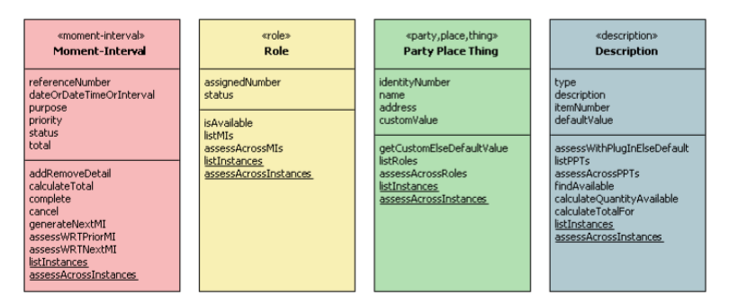
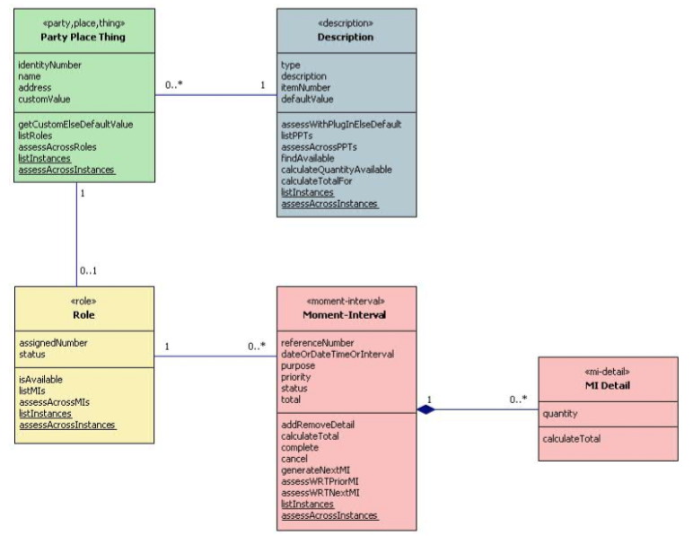
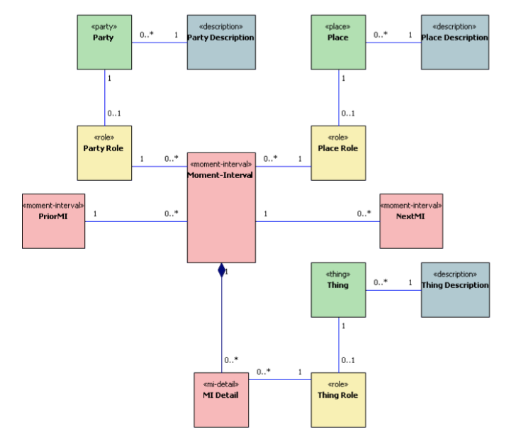

# Modeling in Color

## Next

- [x] flesh out descriptions of archetypes
- [ ] interweave the example domain "Transplant Management" into the notes below.
- [ ] add sequence diagrams
- [ ] add business rules/policies
- [ ] add triggers

## To-do items

Your deliverables (modeling benefits, list of strategies + related examples, informal overview of project)

- [x] finished the diagram, so anywhere you have `-` maybe you can fill that in
- [x] we need a list of “benefits” for the modeling technique, so you can piece that together.
- [x] list of a handful of strategies as well as some descriptions of examples we can relate to in the domain model e.g.:
    - "Start by thinking through events"
    - "Figure out how to separate entities from descriptions"
- [x] come up with two more, we’d be in good shape
- [x] A high level overview of the system.  You have a small list of features, I’d want something along those lines but in a prose format. We need this to fill in the back story around the diagram and to give the reader an understanding of the context we’re working in.
## Tips:

- "Start with too much material, then give the reader just enough"

# Introduction

- Object Modeling approach
- Use four archetypes to identify common responsibilities of objects
- Assigns unique colors to each archetype
- Makes modeling tools such as UML more visual
- Developed by Peter Coad, Eric Lefebvre, and Jeff De Luca

# Benefits

- accelerated domain modeling and understanding: archetypes allow you to quickly dissect a domain, leverage an existing meta-model to understand new domains, understand new domains by leverage examples from unrelated domains (e.g. this is like a partial shipment in an commerce domain)
- foundational communication tool: provides a common language to discuss domain models with your team members, similar benefits as "design patterns" provides
- agile collaboration tool: the format (e.g. color) lends itself to low-fidelity modeling techniques using post-it notes
- color makes the archetypes easy to learn
- allows to understand foreign and complex domains

# Key Strategies

- identify the Events - what are the "hot spots" (red) in the system
- use 5 "W's" (who, what, where, when, why) to drive discovery
- keep the domain model of e-commerce in my back pocket as it provides an excellent example of many different domain patterns that can be used as a reminder of those patterns

```
order       - shipment       - return
  |                |              |
order_items - shipment_items - return-items
  |
item_in_sale
  |
product - price
```
- a tool to prevent myself from going down the rabbit hole, always ask "does the system need to remember this?"
- separate Entities from Descriptions

# Process

- stakeholders, product owner typically describe the domain with the key business transaction
  - order management
  - reservations
  - transplants
- business applications manage and/or automate those transactions
- the key business transaction (event) is our starting point for discovery
- the process outlined below is only a rough estimate, rarely happens in an "exact" order
- however, the idea of separating "discovery" from "refinement" I have found quite useful

**Transplant Example:**

- the "transplant" actually involves two key events, an operation for both the recipient and the donor

## Iteration 1: Discovery

- determine the "why": the reason and causality for the key event, this helps to flesh out the other "W's"
- they "why" may end up as a "purpose" attribute on the Event (as an enumeration or free text)
- continue with identifying the "entities" collaborating in the event
- "who" (aka actors): who collaborates in the event (parties: people, organisations)
- "where": where does the even take place (place)
- "what": what is used (things)
- determine the nature of the event, "when": when does the event occur, is it discrete, evolving, or recurring[1] (moment-interval)
- event typically don't occur in isolation
- explore if preceding and proceeding events (forming the follow-up pattern)
- build up a timeline of events, determine the "why", identify the "entities" for each
- throughout add obvious attributes and behavior

**Transplant Example:**

- why: a `patient` has reached `end-stage renal failure` which means a `patient` no longer has use of their renal organ and it will not return. At this stage the patient requires dialysis to survive and a transplant is considered to improve quality of life.
- who: the actual transplant is an `operation` on two patients; for a transplant to occur requires a patient receiving an organ, the `recipient` and a patient donating an organ, the `living donor`
- where: the transplant requires an operation at a `hospital/site`
- what: the `operation` transplants an `organ` (kidney, liver, pancreas)
- when: the `operation` itself is a discrete event, but the transplant process has preceding and follow-up events
  - for a recipient to participate in a transplant operation, a potential `donation` must be identified
  - the potential `living donor` must have a successful `donor assessment` for the transplant to be scheduled
  - the `donation` requires the `recipient` to have a `recipient assessment` successfully completed to ensure a `recipient` is applicable for a transplant, and is used for comparison to determine if the `recipient` and `donor` are a "match"
- in the absence of a living donor, a patient will be registered (`registration`) on a `waitlist` for a cadaveric donor.
- that completes the preceding events, what about the proceeding?
- [continue from here]

## Iteration 3: Refinement

- extract Roles from entities
- then model the Roles they play in a system (see behaviour)
- identify/extract Descriptions from Entities
- often mistakenly model objects as Entities (things) when they have responsibilities that follow a Description's archetype
- determine less obvious attributes: lifecycle and operating states, event dates
- promote attributes to objects
- demote objects to attributes

**Transplant Example:**

- an entity can be a party (person, organization), party or place
- I often find there is not benefit of modeling a person explicitly in code, so the person responsibilities are "folded" into the the role
- in the case the person responsibilities are folded into the patient role
-  a `person` must be a `patient` before they are a `recipient`, likewise for a `living donor`, an example of the "subsequent role pattern"

## Iteration 3: Behavior

- determine business rules: what conditions must be met for objects to collaborate
- derive feature list (interactions)  
- test model with interactions

## Object Modeling

- what is it?
- when do I use it?
- why should I use it?

## Domain

- problem area with a boundary
- domain models
   - aka business objects, problem domain (PD) objects, models
   - specific concern
   - represent objects in the problem domain
- specific concern/set of responsibilities (see Archetypes)
  - not UI/View (they display PD objects)
  - not database (they persist PD objects)
  - embedded business rules for collaborations between PD objects

## Archetypes

- "a form which all things of the same kind more or less follow" (JMICWU pg 2)
- the form being an object's responsibilities (see summary below):
  - what I know
  - who I know
  - what I do
- in other words:
  - attributes
  - collaborations (links) (see the Domain Neutral Component)
  - methods
  - plug-in points
  - interactions
- responsibilities are not exactly the same, typically a sub-set, but may include others as well specific to the domain

### Typical Responsibilities (Attributes and Behaviour)

Illustrates the typical attributes and behavior archetypes have.




### Typical Collaborations

Illustrates the typical collaborations and interactions archetypes have.



### Domain Neutral Component (DNC)

Events with the "what", "who", and "where". Note Entity "what", connected to the Event detail.



- archetypal pattern for object models
- just a template
- remove classes with no responsibilities
- 1-1 associations indicate opportunity to combine classes


## Events (Pink)

- required to be recorded for business or legal purposes [Coad99
- "moment" in time or over an "interval" of time
- related to an action or activity
- other archetypes describe who, what, where
- interactions between entities (parties, places, things)
- examples (activity):
  - registration (registering)
  - order (ordering)
  - reservation (reserving)
  - subscription (subscribing)
- types
  - discrete
  - evolving
  - recurring
- patterns
  - follow-up
  - composite
  - history value (event - description)

## Roles (Yellow)

- Roles model the behavior of an Entity collaborating with an Event (i.e participation in an event)
- may also have attributes
- one of the most important archetypes in avoiding god-objects by reducing the responsibilities of Entities
- role checks
  - a person
  - player object qualifies for the role (e.g age)
  - conflicting roles
  - must be playing a role
- examples:
  - customer
  - sales person
  - employee


## Entities (Green)

- Entities play different roles
- Coad refer to Roles as hats Entities wear
- Entities can play many Roles
- parties (people, organizations), aka actors
- places
- things
- examples:
  - person
  - city
  - computer

> Another name sometimes suggested for this archetype is Entity but there are two arguments against using this term. Firstly it is already in use in the data-modelling world and although our parties, places and things naturally map to entities in data modellers' Entity-Relationship diagrams, the converse is not necessarily true. Secondly, the name Party, Place, Thing neatly reminds us that this archetype comes in three flavours, a fact that is of significance in the various analysis patterns involving class archetypes.

-- http://www.step-10.com/SoftwareDesign/ModellingInColour/

## Descriptions (Blue)

- "catalog-entry like description"
- blue "labels"
- the "knowledge" layer in the "knowledge-operation layers" MARTIN
- toughest archetype to differentiate from Entities
- my favorite example to help understand the difference: product_description#sku vs. product#serial_number
- Entities are uniquely identifiable; e.g. product#serial_number
- Descriptions describe a group of objects; e.g. product#sku
- hence Coad's use of "catalog-entry like description"
- provide run-time inheritance for Entities, e.g. the common attributes and methods
- can also describe Events
- examples:
  - product description

# Footnotes

[1] [Agile Data Warehouse Design](http://www.amazon.com/Agile-Data-Warehouse-Design-Collaborative/dp/0956817203/ref=sr_1_1?s=books&ie=UTF8&qid=1453645838&sr=1-1)
